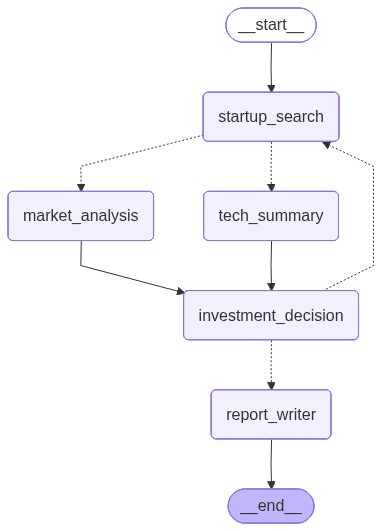
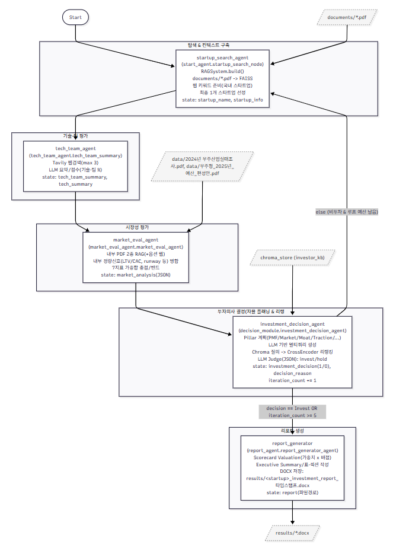

# 🚀 Space Industry Startup Investment Evaluation Agent

본 프로젝트는 위성(우주산업) 스타트업의 투자 가능성을 자동으로 평가하는 AI Agentic RAG 시스템입니다.
LangGraph 기반의 멀티에이전트 구조를 통해 시장성·기술력·팀·재무 정보를 분석하고, LLM 스코어카드로 종합 투자 판단을 수행합니다.
특히, 실제 스타트업 헌터(Startup Hunter)와 투자 전문가들의 분석 패턴을 모델링하여, 단순 데이터 기반 평가를 넘어 **현장 감각이 반영된 투자 판단**을 목표로 합니다.

---

## 🧭 Overview

- **Objective**  
  위성 스타트업의 시장성·기술력·팀·재무 제표를 RAG + LLM 스코어카드로 종합 평가해 투자 판단을 자동화

- **Method**  
  AI Agent + Agentic RAG + Web Search 기반 다중 에이전트 의사결정 시스템

- **Tools**  
  Tavily 웹 검색, FAISS/Chroma 벡터스토어, LangGraph/LLM 기반 평가 파이프라인

---

## 🧩 Features

- **하이브리드 RAG 기반 컨텍스트 생성**  
  - LangChain 문서 분할 + FAISS 로컬 검색  
  - PDF 문서 기반 산업 데이터 참조  
    - `2024년 우주산업실태조사 보고서(최종본).pdf`  
    - `우주청_2025년_예산_편성안.pdf`  
    - `startup_doc.pdf` : 투자 분석가 article 모음  
    - `20230130_NEW CONVERGENCE.pdf` : 한국 우주산업 현황  

- **Tavily + LLM 조합으로 기술·팀 경쟁력 요약**  
  - 실시간 웹 검색 결과를 LLM에 통합  
  - 정성 평가 결과를 정량 점수(JSON)로 변환  

- **시장성 7개 지표 스코어카드 생성**  
  - Market Size / Growth / Demand Signals / Entry Barriers /  
    Policy Tailwind / Competition Intensity / GTM Feasibility  
  - `market_eval_agent.py`, `decision_module.py`에서 자동 산출  

- **LLM 기반 투자 보고서 자동 생성**  
  - 각 에이전트 결과를 통합하여 DOCX 형태의 리포트 생성  
  - `report_agent.py`에서 실행 가능  

---

## ⚙️ Tech Stack

| Category   | Details                           |
|-------------|------------------------------------|
| **Framework** | LangGraph, LangChain, Python |
| **LLM**        | GPT-4o-mini (via OpenAI API) |
| **Retrieval**  | FAISS, Chroma |
| **Embedding**  | HuggingFace Sentence Embeddings |
| **Web Search** | Tavily API |

---

## 🤖 Agents

| Agent                         | Role    | Description                    | 이름       |
| ----------------------------- | ------- | ------------------------------ | -------- |
| **startup_search Agent**      | 스타트업 탐색 | 국내외 위성 스타트업 데이터 수집             | **조현준**  |
| **tech_summary Agent**, **report_writer Agent**	        | 기술력 평가  | 웹 검색 및 PDF 기반 기술 경쟁력 분석        | **유승연**  |
| **market_analysis Agent**     | 시장성 평가  | 산업 보고서 기반 시장성 스코어 산출           | **정민주**  |
| **investment_decision Agent** | 투자 판단   | 종합 스코어카드로 Invest/Watch/Hold 분류 | **고경남**  |
---

## 🏗️ Architecture




---

## Future Work
[개발 부분]  
- 스타트업 탐색 에이전트 추가 개발  
- 시간이 과도하게 걸리는 RAG 적용한 에이전트들의 속도를 높이는 방안 탐색  
- 보고서 생성 에이전트 추가 개발  
[추가 에이전트 부분]  
- 정부가 제공하는 스타트업 혜택이 끝나서 혜택을 받고자 다시 만든 스타트업인지 -> Web Search 사용하여 동일한 이름의 대표가 존재하는 회사 찾기 ->  
-> 존재한다면 기존 회사의 LTV(담보 인정 비율), 신용평가 등의 지표는 어떻게 되는지  

## 📁 Directory Structure

```bash
├── chroma_store/ # Chroma 벡터스토어 데이터
├── config/ # 환경 설정 파일 (예: 환경 변수, 모델 설정)
├── data/ # 산업 보고서, PDF 등 원본 데이터
├── documents/ # 정리된 문서, 중간 결과물 저장
├── knowledge_base/ # 임베딩된 지식 베이스 저장소
├── public/ # 시각 자료, 이미지(예: architecture diagram)
├── decision_module.py # 투자 의사결정 로직 모듈
├── graph.py # LangGraph 워크플로 정의
├── market_eval_agent.py # 시장성 평가 Agent
├── report_agent.py # DOCX 보고서 자동 생성 Agent
├── start_agent.py # 전체 에이전트 실행 스크립트
├── start_rag_system.py # RAG 초기화 및 실행 파이프라인
├── startup-agent.ipynb # 노트북 실험 버전 (개발용)
├── tech_team_agent.py # 기술/팀 경쟁력 평가 Agent
├── app.py # 테스트용 스크립트
│
└── README.md # 프로젝트 설명 문서
```
